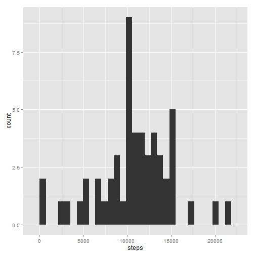
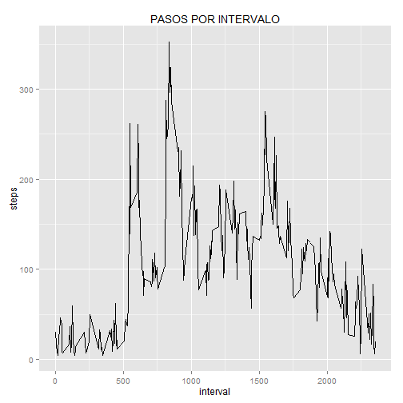
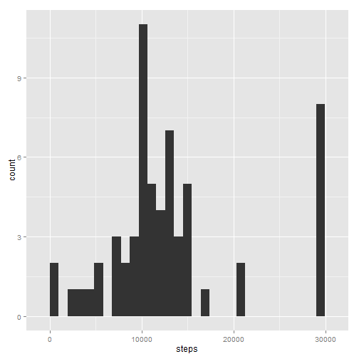
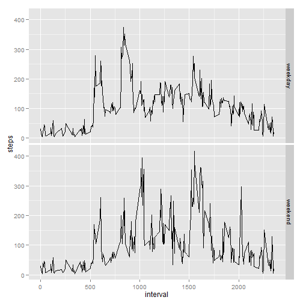

It is now possible to collect a large amount of data about personal movement using activity monitoring devices such as a Fitbit, Nike Fuelband, or Jawbone Up. These type of devices are part of the “quantified self” movement – a group of enthusiasts who take measurements about themselves regularly to improve their health, to find patterns in their behavior, or because they are tech geeks. But these data remain under-utilized both because the raw data are hard to obtain and there is a lack of statistical methods and software for processing and interpreting the data.It is now possible to collect a large amount of data about personal movement using activity monitoring devices such as a Fitbit, Nike Fuelband, or Jawbone Up. These type of devices are part of the “quantified self” movement – a group of enthusiasts who take measurements about themselves regularly to improve their health, to find patterns in their behavior, or because they are tech geeks. But these data remain under-utilized both because the raw data are hard to obtain and there is a lack of statistical methods and software for processing and interpreting the data.

## Loading and preprocessing the data

1.Load the data (i.e. read.csv())

2.Process/transform the data (if necessary) into a format suitable for your analysis


```r
data_act<-read.csv("activity.csv") ## read data
data_act$date<-as.Date(data_act$date) ## convert the date format
data_act$steps<-ifelse(data_act$steps==0,NA,data_act$steps) ## convert the 0 values like NA because a dont take for calculations
```

## What is mean total number of steps taken per day?

1.Make a histogram of the total number of steps taken each day


```r
library(reshape2)
library(ggplot2)
melt_data<-melt(data_act,id=c("date"),measure.vars=("steps"),na.rm=TRUE)
sum_act<-dcast(melt_data,date~variable,sum)
qplot(steps,data=sum_act)
```

```
## stat_bin: binwidth defaulted to range/30. Use 'binwidth = x' to adjust this.
```

 

2.Calculate and report the mean and median total number of steps taken per day


```r
mean1<-mean(melt_data$value)
median1<-median(melt_data$value)
summary<-data.frame(mean1,median1)
print(summary)
```

```
##   mean1 median1
## 1 134.3      56
```

## What is the average daily activity pattern?

1.Make a time series plot (i.e. type = "l") of the 5-minute interval (x-axis) and the average number of steps taken, averaged across all days (y-axis)


```r
library(ggplot2)
melt_time<-melt(data_act,id=c("interval"),measure.vars=("steps"),na.rm=TRUE)
average_time<-dcast(melt_time,interval~variable,mean)
g<-qplot(interval,steps,data=average_time,geom="line")
g+labs(title="PASOS POR INTERVALO")
```

 

2.Which 5-minute interval, on average across all the days in the dataset, contains the maximum number of steps?


```r
max_time<-max(average_time$steps)
average_time[average_time$steps==max_time,]
```

```
##    interval steps
## 86      835 352.5
```
## Imputing missing values

1.Calculate and report the total number of missing values in the dataset (i.e. the total number of rows with NAs)


```r
data_act1<-read.csv("activity.csv")
data_act1$date<-as.Date(data_act1$date)
length(which(is.na(data_act1$steps)==TRUE))
```

```
## [1] 2304
```

2.Devise a strategy for filling in all of the missing values in the dataset.

**My strategy was filling the NA's with the general average per interval... For example, I use the general mean for 5-minute interval for all the NA's that belongs in that interval...**


```r
datamerge<-merge(data_act1,average_time,by.x="interval",by.y="interval")
datamerge$steps_f<-ifelse(is.na(datamerge$steps.x),datamerge$steps.y,datamerge$steps.x)
```

3.Create a new dataset that is equal to the original dataset but with the missing data filled in.


```r
data_act_new = data.frame(datamerge$interval, datamerge$date, datamerge$steps_f)  
colnames(data_act_new)<-c("interval","date","steps")
data_act_new$steps<-ifelse(data_act_new$steps==0,NA,data_act_new$steps)
data_act_new<-data_act_new[order(data_act_new$date, data_act_new$interval),]
```

4.Make a histogram of the total number of steps taken each day and Calculate and report the mean and median total number of steps taken per day. Do these values differ from the estimates from the first part of the assignment? What is the impact of imputing missing data on the estimates of the total daily number of steps?


```r
library(ggplot2)
melt_data_new<-melt(data_act_new,id=c("date"),measure.vars=("steps"),na.rm=TRUE)
sum_act_new<-dcast(melt_data_new,date~variable,sum)
qplot(steps,data=sum_act_new)
```

```
## stat_bin: binwidth defaulted to range/30. Use 'binwidth = x' to adjust this.
```

 
### THE VALUES ARE THE SAME, BECAUSE A TAKE 0 LIKE A REAL LECTURE


```r
mean2<-mean(melt_data_new$value)
median2<-median(melt_data_new$value)
summary_new<-data.frame(mean2,median2)
print(summary_new)
```

```
##   mean2 median2
## 1 125.4      72
```
## Are there differences in activity patterns between weekdays and weekends?

1.Create a new factor variable in the dataset with two levels – “weekday” and “weekend” indicating whether a given date is a weekday or weekend day.


```r
data_act_new$weekdays<-weekdays(data_act_new$date)
data_act_new$type_day<-ifelse((data_act_new$weekdays=="sabado"|data_act_new$weekdays=="saturday"|data_act_new$weekdays=="domingo"|data_act_new$weekdays=="sunday"),"weekend","weekday")
```

2.Make a panel plot containing a time series plot (i.e. type = "l") of the 5-minute interval (x-axis) and the average number of steps taken, averaged across all weekday days or weekend days (y-axis). 


```r
library(ggplot2)
melt_time_new1<-melt(data_act_new,id=c("interval","type_day"),measure.vars=("steps"),na.rm=TRUE)
average_time_new<-dcast(melt_time_new1,interval+type_day~variable,mean)
qplot(interval,steps,data=average_time_new,facets=type_day~.,geom="line")
```

 
